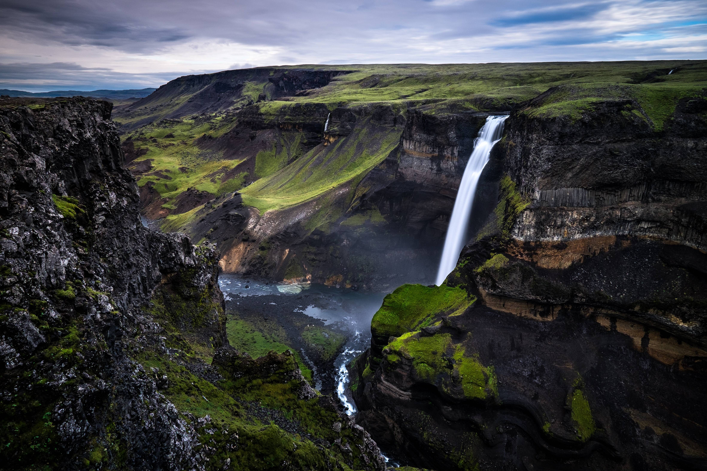

# Hey! #

 Thanks for stopping by my Github! Here you'll find a few of the projects that I've been working on. I'm interested in: 
   1. Natural Language Processing 
   2. Space Exploration
   3. And basically anything else data science related!

## You can find my full portfolio here: https://alyssa-rose.github.io/
## And my TedX talk here on the implications of data science in current society: https://www.youtube.com/watch?v=rROVZHkxOOM

 I graduated from the Tufts University School of Engineering with a B.S. in Data Science in 2021, where I graduated Magna Cum Laude with additional study in Arabic and 
 Mathematics. I'm currently pursuing a masters in data science at Johns Hopkins University in the Whiting School of Engineering 

